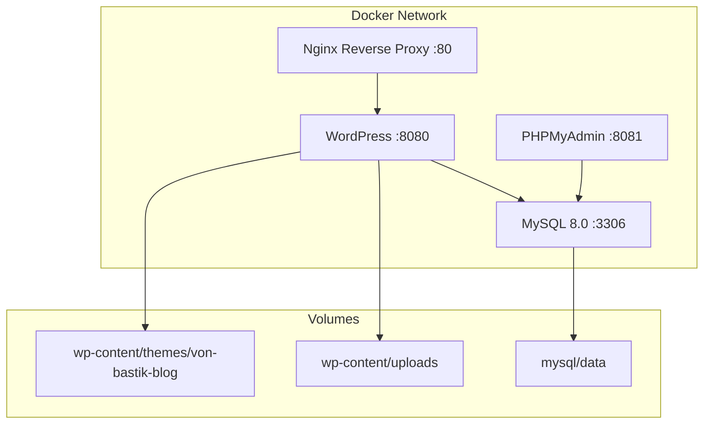
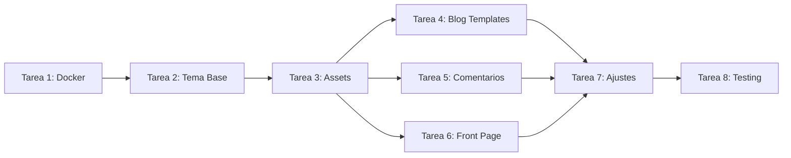

# Plan: WordPress Blog Estilizado - Von Bastik Tattoo

## Resumen

Crear un **tema WordPress personalizado simplificado** enfocado exclusivamente en funcionalidad de blog con:
- Categorías de blog
- Sistema de comentarios
- Página de artículos/listado
- Diseño consistente con la marca Von Bastik Tattoo

---

## Arquitectura Docker Compose



---

## Estructura del Tema WordPress Simplificado

```
wp-content/themes/von-bastik-blog/
├── style.css                        # Header de tema WordPress + estilos principales
├── functions.php                    # Funcionalidades principales
├── screenshot.png                   # Preview del tema
│
├── # --- Plantillas principales ---
├── header.php                       # Cabecera del sitio
├── footer.php                       # Pie de página
├── index.php                        # Plantilla principal (blog)
├── front-page.php                   # Página de inicio (landing simple)
├── single.php                       # Artículo individual
├── page.php                         # Páginas estáticas
├── archive.php                      # Archive por categoría/fecha
├── 404.php                          # Página 404
├── search.php                       # Resultados de búsqueda
│
├── # --- Componentes del blog ---
├── comments.php                     # Template de comentarios
├── content.php                      # Partial para artículos
├── content-excerpt.php              # Partial para listados
│
├── # --- Panel de administración ---
├── admin/
│   ├── admin.php                    # Boot del admin
│   └── blog-settings.php            # Ajustes específicos del blog
│
├── # --- Inclusión modular ---
├── inc/
│   ├── setup.php                    # Configuración del tema
│   └── enqueue.php                  # Enqueue de scripts/styles
│
├── assets/
│   ├── css/
│   │   ├── style.css                # Estilos frontend
│   │   └── admin.css                # Estilos admin
│   ├── js/
│   │   ├── app.js                   # JavaScript frontend
│   │   └── admin.js                 # JavaScript admin
│   └── images/
│       ├── logo.png
│       └── banner.jpg
│
├── parts/
│   ├── navbar.php                   # Componente navbar
│   └── hero-section.php             # Componente hero
│
└── template-blog.php                # Template personalizado para blog
```

---

## Funcionalidades del Blog

### 1. Página de Artículos (Listado)

**Ubicación**: `/blog` o página configurada como página de posts

**Componentes**:
- Grid de artículos con imagen destacada, título, excerpt, fecha, autor
- Paginación (navegación anterior/siguiente)
- Sidebar con:
  - Buscador
  - Categorías del blog
  - Posts recientes
  - Tags populares
- Filtro por categoría

### 2. Artículo Individual (Single Post)

**Componentes**:
- Imagen destacada (hero)
- Meta información: autor, fecha, categoría, tiempo de lectura
- Contenido del artículo (editor WYSIWYG)
- Tags del artículo
- Botones de compartir en redes sociales
- Sección de comentarios
- Posts relacionados (misma categoría)
- Navegación anterior/siguiente

### 3. Sistema de Categorías

**Categorías por defecto**:
- Noticias del estudio
- Galería de trabajos (showcase)
- Eventos y colaboraciones
- Consejos de diseño
- Cuidados post-tatuaje

**Funcionalidades**:
- Página de archive por categoría
- Badge de categoría en cada artículo
- Filtro de categorías en sidebar
- Gestión desde WordPress admin

### 4. Sistema de Comentarios

**Funcionalidades**:
- Comentarios anidados (respuestas)
- Campos: nombre, email, website (opcional)
- Moderación de comentarios (pendiente/aprobado/spam)
- Avatares (Gravatar)
- Campos personalizados opcionales
- Spam protection (Akismet compatible)

### 5. Página de Inicio (Front Page)

**Componentes**:
- Hero section con banner
- Sección de últimos artículos (3-6 posts)
- Call to action para seguir en redes
- Footer con información del estudio

---

## Estructura del Menú de Administración

```
WordPress Admin
│
├── Entradas (Blog nativo)
│   ├── Todas las Entradas
│   └── Añadir Nueva
│
├── Categorías (Taxonomía nativa)
│
├── Etiquetas (Taxonomía nativa)
│
├── Comentarios
│   ├── Todos los Comentarios
│   └── Pendientes
│
├── Ajustes
│   └── Ajustes del Blog Von Bastik
│       ├── Página de inicio del blog
│       ├── Mostrar X artículos por página
│       └── Habilitar/deshabilitar comentarios
│
└── Apariencia
    ├── Menús
    ├── Widget
    └── Editor de archivos
```

---

## Tareas de Implementación

### Tarea 1: Configuración del Entorno Docker

**Objetivo**: Crear el entorno Docker para WordPress.

**Entregables**:
- `docker-compose.yml` con servicios:
  - `wordpress`: Imagen oficial wordpress:latest
  - `mysql`: MySQL 8.0 con datos persistentes
  - `nginx`: Reverse proxy para acceso en puerto 80
  - `phpmyadmin`: Panel de administración de base de datos
- `Dockerfile` para WordPress personalizado
- `nginx/nginx.conf` con configuración de proxy
- `.dockerignore` para excluir archivos innecesarios

### Tarea 2: Estructura Base del Tema

**Objetivo**: Crear la estructura fundamental del tema WordPress.

**Entregables**:
- `style.css` con header de tema WordPress
- `functions.php` con:
  - Registro de menús
  - Soporte de themes (featured images, post thumbnails)
  - Enqueue de CSS y JS
  - Widget areas
- `header.php` con estructura HTML semántica
- `footer.php` con footer completo
- `index.php` como fallback
- `front-page.php` para la página de inicio

### Tarea 3: Migración de Assets

**Objetivo**: Migrar recursos estáticos del sitio actual al tema.

**Entregables**:
- `assets/css/style.css` - CSS migrado del sitio original
- `assets/js/app.js` - JavaScript frontend
- `assets/images/` - Imágenes del estudio
- Configuración de `functions.php` para enqueue correcto

### Tarea 4: Plantillas del Blog

**Objetivo**: Implementar todas las plantillas necesarias para el blog.

**Entregables**:
- `single.php` - Artículo individual
- `archive.php` - Archive por categoría/fecha
- `search.php` - Resultados de búsqueda
- `content.php` - Partial para artículos
- `content-excerpt.php` - Partial para listados
- `template-blog.php` - Template personalizado

### Tarea 5: Sistema de Comentarios

**Objetivo**: Implementar comentarios con diseño personalizado.

**Entregables**:
- `comments.php` - Template de comentarios
- Estilos para comentarios anidados
- Configuración de moderación
- Spam protection

### Tarea 6: Página de Inicio y Navegación

**Objetivo**: Crear la landing page y navegación del sitio.

**Entregables**:
- `front-page.php` con hero + últimos artículos
- `parts/navbar.php` con menú responsive
- `parts/hero-section.php` con banner
- Configuración de menú en WordPress

### Tarea 7: Ajustes del Tema

**Objetivo**: Configurar opciones administrativas del blog.

**Entregables**:
- `admin/blog-settings.php` - Página de ajustes
- Opciones: página de blog, artículos por página, comentarios
- Integración con WordPress Customizer

### Tarea 8: Pruebas y Validación

**Objetivo**: Verificar funcionalidad completa.

**Entregables**:
- Checklist de pruebas completas
- Documentación de uso

---

## Plan de Ejecución



---

## Archivos a Generar

### Docker
- `docker-compose.yml`
- `Dockerfile`
- `nginx/nginx.conf`
- `.dockerignore`

### Tema WordPress
- `themes/von-bastik-blog/style.css`
- `themes/von-bastik-blog/functions.php`
- `themes/von-bastik-blog/header.php`
- `themes/von-bastik-blog/footer.php`
- `themes/von-bastik-blog/index.php`
- `themes/von-bastik-blog/front-page.php`
- `themes/von-bastik-blog/page.php`
- `themes/von-bastik-blog/single.php`
- `themes/von-bastik-blog/archive.php`
- `themes/von-bastik-blog/search.php`
- `themes/von-bastik-blog/comments.php`
- `themes/von-bastik-blog/content.php`
- `themes/von-bastik-blog/content-excerpt.php`
- `themes/von-bastik-blog/template-blog.php`
- `themes/von-bastik-blog/parts/navbar.php`
- `themes/von-bastik-blog/parts/hero-section.php`
- `themes/von-bastik-blog/admin/admin.php`
- `themes/von-bastik-blog/admin/blog-settings.php`
- `themes/von-bastik-blog/inc/setup.php`
- `themes/von-bastik-blog/inc/enqueue.php`
- `themes/von-bastik-blog/assets/css/style.css`
- `themes/von-bastik-blog/assets/css/admin.css`
- `themes/von-bastik-blog/assets/js/app.js`
- `themes/von-bastik-blog/assets/js/admin.js`

---

## Checklist de Pruebas

- [ ] WordPress arranca correctamente en Docker
- [ ] Tema se activa y muestra correctamente
- [ ] Panel de administración accesible
- [ ] Crear/editar/publicar artículos funciona
- [ ] Categorías de blog funcionan
- [ ] Página de artículos muestra listado correcto
- [ ] Artículo individual renderiza correctamente
- [ ] Sistema de comentarios funciona
- [ ] Moderación de comentarios funciona
- [ ] Buscador de artículos funciona
- [ ] Filtro por categorías funciona
- [ ] Paginación funciona
- [ ] Posts relacionados muestran contenido relevante
- [ ] Menú responsive funciona
- [ ] Responsive design verificado
- [ ] SEO meta tags preservados
- [ ] JSON-LD schema preservado
