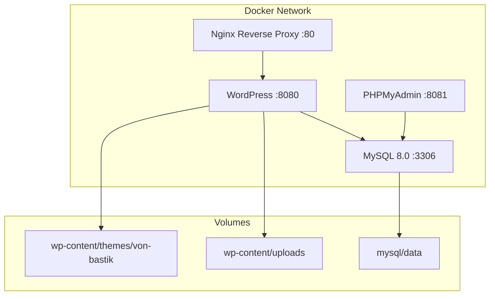
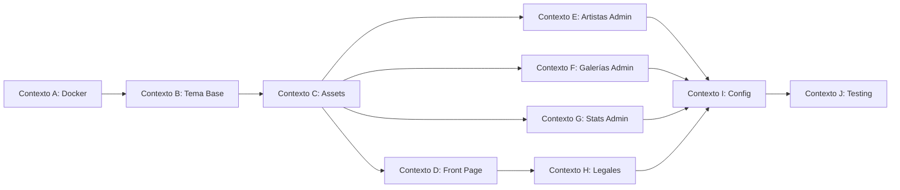

# Plan de Migración: Von Bastik Tattoo → WordPress con Docker Compose

## Resumen del Proyecto

Migrar el sitio web estático de **Von Bastik Tattoo Studio** (actualmente HTML/CSS/JS) a un **tema WordPress personalizado** con panel de administración completo para:
- Gestionar perfiles de artistas (CRUD completo)
- Gestionar galerías de trabajos (añadir, editar, eliminar fotos)
- Gestionar entradas de blog (crear, editar, publicar artículos)
- Añadir o eliminar artistas
- Manejar estadísticas de visitas
- Administrar contenido del sitio

---

## Arquitectura Docker Compose



---

## Estructura del Tema WordPress

```
wp-content/themes/von-bastik/
├── style.css                        # Header de tema WordPress + estilos
├── functions.php                    # Funcionalidades principales
├── screenshot.png                   # Preview del tema
│
├── # --- Plantillas principales ---
├── header.php                       # Cabecera del sitio
├── footer.php                       # Pie de página
├── index.php                        # Plantilla principal
├── front-page.php                   # Página de inicio
├── single.php                       # Single post (artistas)
├── page.php                         # Páginas estáticas
├── 404.php                          # Página 404
│
├── # --- Templates personalizados ---
├── template-artist.php              # Template para artistas
├── template-gallery.php             # Template para galerías
│
├── # --- Panel de administración ---
├── admin/
│   ├── admin.php                    # Boot del admin
│   ├── artist-meta-boxes.php        # Meta boxes para artistas
│   ├── gallery-meta-boxes.php       # Meta boxes para galerías
│   ├── stats-dashboard.php          # Dashboard de estadísticas
│   ├── custom-columns.php           # Columnas personalizadas en admin
│   └── settings-page.php            # Página de ajustes del tema
│
├── # --- Inclusión modular ---
├── inc/
│   ├── setup.php                    # Configuración del tema
│   ├── enqueue.php                  # Enqueue de scripts/styles
│   ├── custom-post-types.php        # CPT: Artists, Gallery
│   ├── custom-taxonomies.php        # Taxonomías: Categorías de galería
│   ├── shortcodes.php               # Shortcodes personalizados
│   └── ajax-handlers.php            # Handlers AJAX
│
├── assets/
│   ├── css/
│   │   ├── style.css                # Estilos frontend
│   │   └── admin.css                # Estilos admin
│   ├── js/
│   │   ├── app.js                   # JavaScript frontend
│   │   └── admin.js                 # JavaScript admin
│   └── images/
│       ├── logo.png
│       ├── banner.jpg
│       └── services/
│
├── parts/
│   ├── navbar.php                   # Componente navbar
│   └── hero-section.php             # Componente hero
│
├── # --- Plantillas de blog ---
├── blog.php                         # Archivo principal del blog
├── archive.php                      # Archive (categorías, fechas)
├── single-post.php                  # Single post template
└── page-blog.php                    # Template para página de blog
```

---

## Custom Post Types y Taxonomías

### 1. Custom Post Type: `artist`

**Perfiles de artistas del estudio**

| Campo | Tipo | Descripción |
|-------|------|-------------|
| `artist_bio` | WYSIWYG Editor | Biografía del artista |
| `artist_specialties` | Text/Repeater | Especialidades (realismo, blackwork, fine line...) |
| `artist_hero_image` | Image Upload | Imagen hero del artista |
| `artist_social_facebook` | Text | URL Facebook |
| `artist_social_instagram` | Text | URL Instagram |
| `artist_social_tiktok` | Text | URL TikTok |
| `artist_social_youtube` | Text | URL YouTube |
| `artist_featured_order` | Number | Orden de aparición en front-page |
| `artist_active` | Checkbox | Activo/Inactivo |

**Columnas del admin**: Thumbnail, Título, Orden, Activo, Galería, Fecha

### 2. Custom Post Type: `gallery_item`

**Trabajos/fotos de la galería**

| Campo | Tipo | Descripción |
|-------|------|-------------|
| `gallery_artist` | Post Object | Artista asociado |
| `gallery_category` | Taxonomía | Categoría del trabajo |
| `gallery_featured_image` | Image Upload | Imagen del trabajo |
| `gallery_full_image` | Image Upload | Imagen completa (lightbox) |
| `gallery_description` | Text | Descripción del trabajo |
| `gallery_client_name` | Text | Nombre del cliente (opcional) |
| `gallery_date` | Date | Fecha del tatuaje |
| `gallery_featured` | Checkbox | Destacado en front-page |
| `gallery_order` | Number | Orden de aparición |

**Columnas del admin**: Thumbnail, Artista, Categoría, Destacado, Fecha, Orden

### 3. Taxonomía: `gallery_category`

**Categorías para filtrar la galería**

- Realismo
- Blackwork
- Fine Line
- Acuarela
- Geometría
- Japanese
- Otro

### 4. WordPress Posts (Blog)

**Entradas de blog para contenido del estudio**

WordPress usa el post type nativo `post` para el blog. Se configurará con:

| Campo | Tipo | Descripción |
|-------|------|-------------|
| `post_title` | Título | Título del artículo |
| `post_content` | Editor WYSIWYG | Contenido completo del artículo |
| `post_thumbnail` | Featured Image | Imagen destacada del artículo |
| `post_category` | Categoría | Categoría del blog |
| `post_tag` | Tags | Etiquetas del artículo |
| `author` | Autor | Autor del artículo |
| `comment_status` | Comment | Comentarios habilitados/deshabilitados |
| `ping_status` | Ping | Pings habilitados/deshabilitados |

**Columnas del admin**: Thumbnail, Título, Categoría, Tags, Autor, Comentarios, Fecha

### 5. Taxonomía: `post_category` (Blog Categories)

**Categorías para el blog**

- Noticias del estudio
- Tutoriales de cuidado post-tatuaje
- Galería de trabajos (showcase)
- Eventos y colaboraciones
- Consejos de diseño
- Otro

### 6. Taxonomía: `post_tag` (Blog Tags)

**Etiquetas para organizar contenido**

- Blackwork
- Realismo
- Fine Line
- Cuidados
- Diseño
- Estudio

### 1. Dashboard de Estadísticas

**Ubicación**: Menú principal "Von Bastik → Dashboard"

**Métricas mostradas**:
| Métrica | Descripción |
|---------|-------------|
| Visitas totales | Total de visitas al sitio |
| Visitas hoy | Visitas del día actual |
| Visitas esta semana | Visitas de los últimos 7 días |
| Visitas este mes | Visitas del mes actual |
| Páginas más vistas | Top 5 páginas más visitadas |
| Artistas más vistos | Top 3 artistas más visitados |
| Dispositivos | Desktop / Mobile / Tablet |
| Navegadores | Top 3 navegadores |
| Referrers | Top 5 fuentes de tráfico |
| Ubicación | Top 5 ciudades/países |

**Gráficos**:
- Línea temporal de visitas (últimos 30 días)
- Gráfico circular de dispositivos
- Gráfico de barras de páginas más vistas

### 2. Gestión de Artistas

**Ubicación**: Menú principal "Von Bastik → Artistas"

**Funcionalidades**:
- Lista de artistas con thumbnail
- Añadir nuevo artista
- Editar artista existente
- Eliminar artista
- Activar/desactivar artista
- Reordenar artistas (drag & drop)
- Previsualizar perfil

### 3. Gestión de Galerías

**Ubicación**: Menú principal "Von Bastik → Galerías"

**Funcionalidades**:
- Lista de trabajos con thumbnail
- Añadir nuevo trabajo
- Editar trabajo existente
- Eliminar trabajo
- Asignar artista
- Asignar categoría
- Marcar como destacado
- Reordenar trabajos
- Subida múltiple de imágenes
- Bulk edit (asignar artista/categoría a múltiples items)

### 4. Gestión de Blog

**Ubicación**: Menú principal "Entradas" (WordPress nativo)

**Funcionalidades**:
- Lista de artículos con thumbnail
- Añadir nuevo artículo
- Editar artículo existente
- Eliminar artículo
- Programar publicaciones
- Categorías del blog (gestión)
- Tags del artículo
- Imagen destacada (featured image)
- Estado de comentarios (habilitado/deshabilitado)
- Vista previa antes de publicar
- Draft y revisión automática

### 5. Ajustes del Tema

**Ubicación**: Menú principal "Ajustes → Von Bastik"

**Secciones**:
- Información del estudio (nombre, dirección, teléfono, email)
- Horarios de apertura
- Redes sociales (URLs)
- Google Maps API Key (para embed del mapa)
- Configuración de SEO (meta title, description)
- Configuración de formulario de contacto
- Opciones de visualización (mostrar/ocultar secciones)

---

## Estructura del Menú de Administración

```
WordPress Admin
│
├── Dashboard
│   └── Estadísticas Von Bastik (nuevo submenu)
│
├── Artistas (CPT)
│   └── Todos los Artistas
│   └── Añadir Nuevo
│
├── Galerías (CPT)
│   └── Todas las Galerías
│   └── Añadir Nuevo
│
├── Entradas (Blog nativo)
│   └── Todas las Entradas
│   └── Añadir Nueva
│
├── Categorías Blog (Taxonomía)
│
├── Etiquetas Blog (Taxonomía)
│
├── Galerías (CPT)
│   └── Todas las Galerías
│   └── Añadir Nuevo
│
├── Categorías Galería (Taxonomía)
│
├── Páginas
│
├── Comentarios
│   └── Todos los Comentarios
│   └── Pendientes
│
├── Ajustes
│   └── Von Bastik Settings
│
└── Apariencia
    ├── Menús
    ├── Widget
    └── Editor de archivos
```

---

## Tareas por Ventana de Contexto

### Tarea 1: Configuración del Entorno Docker
**Contexto**: Docker Infrastructure

**Objetivo**: Crear el entorno Docker completo para desarrollo WordPress.

**Entregables**:
- `docker-compose.yml` con servicios:
  - `wordpress`: Imagen oficial wordpress:latest
  - `mysql`: MySQL 8.0 con datos persistentes
  - `nginx`: Reverse proxy para acceso en puerto 80
  - `phpmyadmin`: Panel de administración de base de datos
- `Dockerfile` para WordPress personalizado
- `nginx/nginx.conf` con configuración de proxy
- `.dockerignore` para excluir archivos innecesarios
- Volume mounts para desarrollo en caliente del tema

---

### Tarea 2: Estructura del Tema WordPress Personalizado
**Contexto**: Theme Foundation

**Objetivo**: Crear la estructura fundamental del tema WordPress.

**Entregables**:
- `style.css` con header de tema WordPress
- `functions.php` con:
  - Registro de menús
  - Soporte de themes (featured images, post thumbnails)
  - Enqueue de CSS y JS
  - Inicialización del admin
  - Widget areas
- `header.php` con estructura HTML semántica
- `footer.php` con footer completo
- `index.php` como fallback
- `front-page.php` para la página de inicio
- `page.php` para páginas estáticas
- `single.php` para posts individuales
- Archivos base del admin (`admin/admin.php`)

---

### Tarea 3: Migración de Assets al Tema
**Contexto**: Assets Migration

**Objetivo**: Migrar todos los recursos estáticos al tema WordPress.

**Entregables**:
- `assets/css/style.css` - CSS migrado del archivo original
- `assets/js/app.js` - JavaScript migrado con adaptaciones WordPress
- `assets/images/` - Copia de todas las imágenes
- `assets/css/admin.css` - Estilos para el panel de administración
- `assets/js/admin.js` - JavaScript para el panel de administración
- Configuración de `functions.php` para enqueue correcto
- Conversión de rutas absolutas a `get_template_directory_uri()`

---

### Tarea 4: Implementación de la Página de Inicio
**Contexto**: Frontend Development

**Objetivo**: Migrar la página principal `index.html` a WordPress.

**Entregables**:
- `front-page.php` con:
  - Hero section con slideshow
  - Sección de artistas (query de Custom Post Type)
  - Sección de servicios
  - Sección de estadísticas con contadores
  - Sección de galería destacada
  - Sección de testimonios
  - Formulario de contacto
  - Footer
- Integración de typewriter effect
- Integración de parallax
- Integración de scroll reveal animations

---

### Tarea 5: Sistema de Gestión de Artistas
**Contexto**: Admin Development

**Objetivo**: Crear el sistema completo de gestión de artistas.

**Entregables**:
- Custom Post Type `artist` con todos los campos
- Taxonomía personalizada si es necesaria
- Meta boxes en el admin para:
  - Biografía (WYSIWYG)
  - Especialidades (repeater)
  - Imagen hero (media uploader)
  - Redes sociales (fields de texto)
  - Orden y estado activo
- Columnas personalizadas en la lista de artistas
- Shortcode para mostrar artistas: `[artists]`
- `template-artist.php` para el single post
- Query en front-page para mostrar artistas activos

---

### Tarea 6: Sistema de Gestión de Galerías
**Contexto**: Admin Development

**Objetivo**: Crear el sistema completo de gestión de galerías.

**Entregables**:
- Custom Post Type `gallery_item` con todos los campos
- Taxonomía `gallery_category`
- Meta boxes en el admin para:
  - Imagen del trabajo (media uploader)
  - Imagen completa para lightbox
  - Artista asociado (post object selector)
  - Categoría (taxonomy selector)
  - Descripción, nombre del cliente, fecha
  - Destacado y orden
- Subida múltiple de imágenes
- Columnas personalizadas en la lista
- Bulk edit para asignar artista/categoría
- Shortcode para mostrar galería: `[gallery]`
- Filtro por artista y categoría
- Lightbox integrado

---

### Tarea 7: Panel de Estadísticas de Visitas
**Contexto**: Admin Development

**Objetivo**: Crear el sistema de tracking y visualización de estadísticas.

**Entregables**:
- Sistema de tracking de visitas:
  - Contador de visitas por página
  - Tracking de fecha/hora
  - Tracking de dispositivo (user agent)
  - Tracking de navegador
  - Tracking de referrer
  - Tracking de ubicación (IP geolocation)
- Tablas de base de datos para almacenar estadísticas
- Dashboard en el admin con:
  - Métricas principales (visitas totales, hoy, semana, mes)
  - Gráfico de línea temporal (Chart.js)
  - Gráfico circular de dispositivos
  - Tabla de páginas más vistas
  - Tabla de artistas más vistos
  - Tabla de referrers
- AJAX handlers para el tracking en tiempo real
- Opción de exportar estadísticas a CSV
- Limpieza automática de datos antiguos (configurable)

---

### Tarea 8: Sistema de Blog

**Contexto**: Frontend Development

**Objetivo**: Implementar el sistema de blog estándar de WordPress con categorías, comentarios y página de artículos.

**Entregables**:
- `blog.php` - Archivo principal del blog con loop de artículos
- `archive.php` - Archive para categorías y fechas
- `single-post.php` - Template para artículos individuales
- `page-blog.php` - Template para página de blog (listado de artículos)
- `comments.php` - Template de comentarios
- Sidebar del blog con:
  - Buscador
  - Categorías del blog
  - Posts recientes
  - Tags populares
  - Archive por fechas
- Paginación de artículos
- Layout de single post con:
  - Imagen destacada
  - Meta información (autor, fecha, categoría)
  - Contenido del artículo
  - Tags
  - Compartir en redes sociales
  - Sección de comentarios (WP native)
  - Posts relacionados
- Estilos para comentarios anidados
- Widget area para blog sidebar
- Menú de navegación con link al blog

---

### Tarea 9: Implementación de Páginas Legales
**Contexto**: Frontend Development

**Objetivo**: Migrar las páginas legales como páginas de WordPress.

**Entregables**:
- Página "Aviso Legal" con contenido del HTML original
- Página "Política de Cookies" con contenido del HTML original
- Página "Política de Privacidad" con contenido del HTML original
- Banner de cookies en `footer.php` con:
  - Consentimiento de cookies
  - Link a política de cookies
  - Persistencia del consentimiento
- Links en el footer a las páginas legales

---

### Tarea 9: Configuración de Menús, Widgets y Opciones
**Contexto**: Theme Configuration

**Objetivo**: Configurar la administración de contenido de WordPress.

**Entregables**:
- Registro de menús:
  - Main Navigation
  - Footer Navigation
- Widget areas:
  - Footer widgets (4 columnas)
- Página de settings en el Customizer:
  - Información de contacto
  - Redes sociales
  - Horarios del estudio
  - Google Maps embed
- Shortcodes personalizados:
  - `[artists]` - Lista de artistas
  - `[gallery]` - Galería filtrable
  - `[contact-form]` - Formulario de contacto
  - `[stats]` - Estadísticas del estudio
- Plugin de formulario de contacto (Contact Form 7 integrado)

---

### Tarea 10: Pruebas y Validación
**Contexto**: Testing & Documentation

**Objetivo**: Verificar que todo funciona correctamente en el entorno Docker.

**Entregables**:
- Checklist de pruebas:
  - [ ] WordPress arranca correctamente en Docker
  - [ ] Tema se activa y muestra correctamente
  - [ ] Panel de administración accesible
  - [ ] CRUD de artistas funciona (crear, editar, eliminar)
  - [ ] CRUD de galerías funciona (crear, editar, eliminar)
  - [ ] Subida múltiple de imágenes funciona
  - [ ] Filtro de galería por artista y categoría
  - [ ] Lightbox funciona
  - [ ] Dashboard de estadísticas muestra datos
  - [ ] Página de inicio renderiza todas las secciones
  - [ ] Menú responsive funciona
  - [ ] Animaciones de scroll funcionan
  - [ ] Formulario de contacto funciona
  - [ ] Páginas legales accesibles
  - [ ] Banner de cookies funciona
  - [ ] SEO meta tags preservados
  - [ ] JSON-LD schema preservado
  - [ ] Responsive design verificado
- Documentación de uso para el administrador
- Instrucciones de despliegue a producción

---

## Plan de Ejecución en Ventanas de Contexto



### Secuencia de Ejecución

| Paso | Contexto | Tarea | Dependencias |
|------|----------|-------|--------------|
| 1 | Contexto A | Docker Compose Setup | Ninguna |
| 2 | Contexto B | Tema Base | Contexto A |
| 3 | Contexto C | Assets Migration | Contexto B |
| 4 | Contexto D | Front Page | Contexto C |
| 5 | Contexto E | Artistas Admin | Contexto C |
| 6 | Contexto F | Galerías Admin | Contexto C |
| 7 | Contexto G | Stats Admin | Contexto C |
| 8 | Contexto H | Legal Pages | Contexto C |
| 9 | Contexto I | Menus & Widgets | Contextos D, E, F, G, H |
| 10 | Contexto J | Testing & Validation | Todos los anteriores |

---

## Diagrama del Panel de Administración

```mermaid
graph TB
    subgraph WP Admin - Von Bastik
        D[Dashboard Estadísticas]
        A[Artistas CRUD]
        G[Galerías CRUD]
        S[Settings del Tema]
    end
    
    subgraph Artistas CRUD
        A1[Listar Artistas]
        A2[Añadir Artista]
        A3[Editar Artista]
        A4[Eliminar Artista]
        A5[Reordenar]
    end
    
    subgraph Galerías CRUD
        G1[Listar Galerías]
        G2[Añadir Trabajo]
        G3[Editar Trabajo]
        G4[Eliminar Trabajo]
        G5[Subida Múltiple]
        G6[Bulk Edit]
    end
    
    subgraph Dashboard Stats
        S1[Visitas Totales/Hoy/Semana/Mes]
        S2[Gráfico Temporal]
        S3[Páginas Más Vistas]
        S4[Artistas Más Vistos]
        S5[Dispositivos/Navegadores]
        S6[Exportar CSV]
    end
    
    A --> A1 & A2 & A3 & A4 & A5
    G --> G1 & G2 & G3 & G4 & G5 & G6
    D --> S1 & S2 & S3 & S4 & S5 & S6
```



---

## Consideraciones Técnicas

### Base de Datos
- **Motor**: MySQL 8.0
- **Charset**: utf8mb4
- **Collation**: utf8mb4_unicode_ci
- **Tablas adicionales creadas por el tema**:
  - `wp_vb_visits` - Estadísticas de visitas
  - `wp_vb_settings` - Ajustes del tema (si no se usa options table)

### Plugins Recomendados
| Plugin | Propósito |
|--------|-----------|
| Yoast SEO | Optimización SEO |
| Contact Form 7 | Formularios de contacto |
| Smush | Optimización de imágenes |
| UpdraftPlus | Backups |

### Tracking de Visitas - Tabla de Base de Datos

```sql
CREATE TABLE wp_vb_visits (
    id BIGINT UNSIGNED AUTO_INCREMENT PRIMARY KEY,
    page_url VARCHAR(500) NOT NULL,
    page_title VARCHAR(255),
    visit_date DATETIME NOT NULL,
    ip_address VARCHAR(45),
    device_type VARCHAR(20),
    browser VARCHAR(50),
    referrer VARCHAR(500),
    country VARCHAR(100),
    city VARCHAR(100),
    INDEX idx_visit_date (visit_date),
    INDEX idx_page_url (page_url),
    INDEX idx_device (device_type)
);
```

### Optimizaciones
- Lazy loading de imágenes (ya implementado en JS original)
- Conversión de imágenes HEIC a WebP/JPEG
- Minificación de CSS y JS
- Cache con WP Super Cache o W3 Total Cache
- Limpieza automática de visitas antiguas (> 90 días)

---

## Archivos a Generar

### Docker
- `docker-compose.yml`
- `Dockerfile`
- `nginx/nginx.conf`
- `.dockerignore`

### Tema WordPress - Frontend
- `themes/von-bastik/style.css`
- `themes/von-bastik/functions.php`
- `themes/von-bastik/header.php`
- `themes/von-bastik/footer.php`
- `themes/von-bastik/index.php`
- `themes/von-bastik/front-page.php`
- `themes/von-bastik/page.php`
- `themes/von-bastik/single.php`
- `themes/von-bastik/template-artist.php`
- `themes/von-bastik/parts/navbar.php`
- `themes/von-bastik/parts/hero-section.php`

### Tema WordPress - Admin
- `themes/von-bastik/admin/admin.php`
- `themes/von-bastik/admin/artist-meta-boxes.php`
- `themes/von-bastik/admin/gallery-meta-boxes.php`
- `themes/von-bastik/admin/stats-dashboard.php`
- `themes/von-bastik/admin/custom-columns.php`
- `themes/von-bastik/admin/settings-page.php`
- `themes/von-bastik/assets/css/admin.css`
- `themes/von-bastik/assets/js/admin.js`

### Tema WordPress - Inc
- `themes/von-bastik/inc/setup.php`
- `themes/von-bastik/inc/enqueue.php`
- `themes/von-bastik/inc/custom-post-types.php`
- `themes/von-bastik/inc/custom-taxonomies.php`
- `themes/von-bastik/inc/shortcodes.php`
- `themes/von-bastik/inc/ajax-handlers.php`

### Assets
- `themes/von-bastik/assets/css/style.css`
- `themes/von-bastik/assets/js/app.js`
- `themes/von-bastik/assets/images/` (copia de imágenes)
